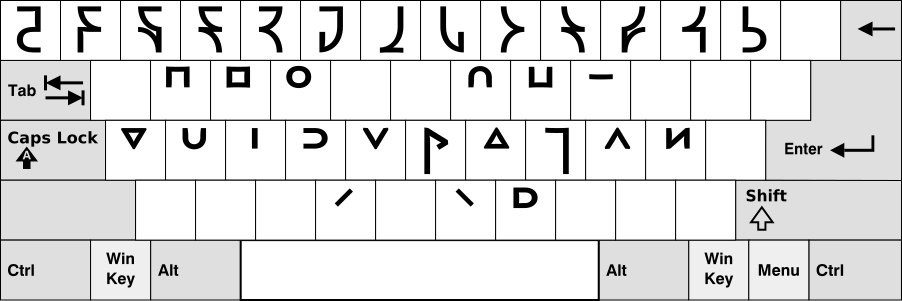

An input method for [Shwa script](http://shwa.org/). Requires ibus-table (check your package manager).

To install on Linux, run these commands:

    $ git clone https://github.com/laMudri/ibus-table-shwa.git
    $ cd ibus-table-shwa
    $ make
    $ make install
    $ ibus restart

Other Unix systems or IBus setups might require a path other than `/usr/share` in the Makefile; see [HowToCreateATableForIBusTable](https://code.google.com/p/ibus/wiki/HowToCreateATableForIBusTable) for more detailed instructions. A Nix package is easy to write, and I'll share mine if desired.

The layout
----------
Half letters written as stressed vowels. Decimal digits are accessed via shift + Qwerty digit (exactly like programmers' Dvorak, incidentally). The key immediately left of backspace is the backslash key. On your keyboard, it could be between shift and Z or above return.

Template [from Wikimedia](https://commons.wikimedia.org/wiki/File:Blank_BRSB_Keyboard_Layout.svg) (GFDL).
