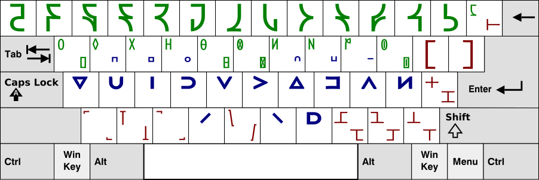

An input method for [Shwa script](http://shwa.org/). Requires ibus-table (check your package manager).

To install on Linux, run these commands:

    $ git clone https://github.com/laMudri/ibus-table-shwa.git
    $ cd ibus-table-shwa
    $ sudo ibus-table-createdb -n /usr/share/ibus-table/tables/shwa.db -s shwa.txt
    $ sudo cp shwa.svg /usr/share/ibus-table/icons/shwa.svg
    $ ibus restart

Other Unix systems or IBus setups might require a path other than `/usr/share`; see [HowToCreateATableForIBusTable](https://code.google.com/p/ibus/wiki/HowToCreateATableForIBusTable) for more detailed instructions.

The layout
----------
Half letters written as stressed vowels unless there is no vowel form, in which case they are given the straight bottom. Decimal digits are accessed via shift + Qwerty digit (exactly like programmers' Dvorak) Template [from Wikimedia](https://commons.wikimedia.org/wiki/File:Blank_BRSB_Keyboard_Layout.svg) (GFDL).

